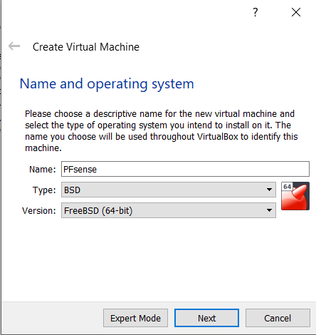
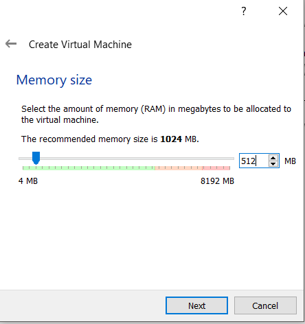
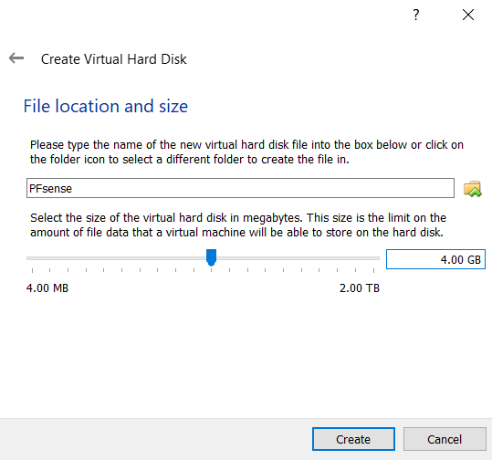

## Written by Sharon Tong
_________________________

### Contact
- Slack: @Sharon on wcscusf.slack.com
- LinkedIn: linkedin.com/in/sharon-tong
- Email: sharont1@mail.usf.edu
### Table of Contents
1. [Prerequisites](#id-link-to-section)
2. [Summary](#id-link-to-section)
3. [Installing PFsense](#id-link-to-section)
4. [Second logical group of Page](#id-link-to-section)
5. [Troubleshooting (optional)](#id-link-to-section)

## Prerequisites 
1. Have your [virtual environment](https://www.virtualbox.org/wiki/Downloads) configured
2. Have the [ISP](link-to-guide) gateway running.

## Summary 
PFsense is an open source firewall that is based on the FreeBSD operating system. Here we will learn how to install and setup PFsense in a virtualization software, in this case, VirtualBox.

## Installing PFsense 
1. Go to the PFsense download page [here] (https://www.pfsense.org/download/)

2. Select the latest version (in this case, version 2.4.2)

3. Select the architecture based on your CPU.
   If you have a 64-bit capable CPU, use the amd64 version. 
   If you have a 32-bit capable CPU, use the i386 version.

4. Select a mirror based on your location.

5. Click 'Download.'

6. After it finishes downloading, open VirtualBox and click on 'New' on the upper left-hand corner. Type 'PFsense' in the 'Name' box,
   select BSD from the 'Type' dropdown menu, and select 'FreeBSD (64-bit)' or 'FreeBSD (32-bit) based on your CPU. Then click 'Next.'

## Second logical group of Page 

## Troubleshooting (optional) 

##### Supporting detail (optional/ title name can change also)
group together logical ideas for the summary if needed
